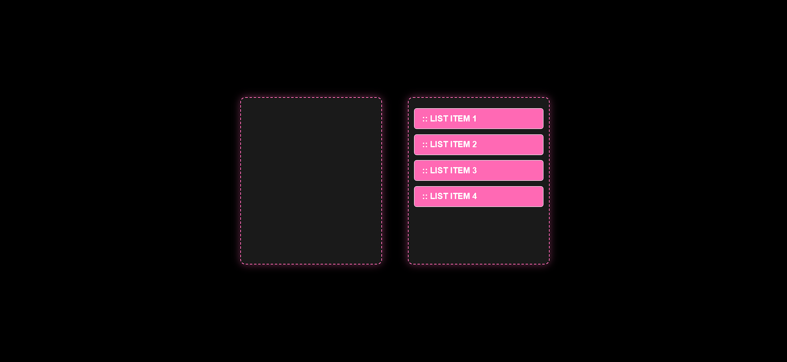

# 🎯 Drag and Drop Boxes Project

A simple, responsive drag-and-drop web interface using **HTML**, **CSS**, and **JavaScript**, styled with a sleek **black and hot pink** theme.

---

## 📁 Project Structure

├── index.html # Main HTML layout
├── style.css # CSS for styling and responsiveness
├── script.js # JavaScript logic for drag-and-drop
└── README.md # Project documentation

---

## ✨ Features

- Two styled drop boxes using Flexbox
- Four draggable items (`:: LIST ITEM 1` to `:: LIST ITEM 4`)
- Smooth drag-and-drop interaction
- Responsive design for all devices
- Visually appealing black + hot pink theme

---

## 🛠 How It Works

### HTML (`index.html`)
- Contains two `.box` containers: one empty, one with draggable items
- Each item is set with `draggable="true"` and event listeners for dragging

### CSS (`style.css`)
- Black background with hot pink highlights
- Boxes styled with dashed borders and glowing shadows
- Items styled for visibility and hover effects
- Responsive layout using `flex-wrap` and media queries

### JavaScript (`script.js`)
- Handles three main functions:
  - `allowDrop(event)`: Enables dropping by preventing default behavior
  - `drag(event)`: Stores the ID of the dragged item
  - `drop(event)`: Appends the dragged item to the drop target

---

## 📱 Responsive Design

- On wider screens, boxes appear side-by-side
- On smaller screens (<600px), boxes stack vertically
- Ensures usability on desktops, tablets, and mobile devices

---

## 🚀 Getting Started

1. Clone or download this repository
2. Open `index.html` in a browser
3. Drag the items between the two boxes and see them move!

---

## 📸 Screenshot

---

## 🧠 Author Notes

This project is ideal for beginners learning:
- DOM manipulation
- Drag-and-drop events
- Responsive web design

---

## 📝 License

This project is open-source and free to use.

